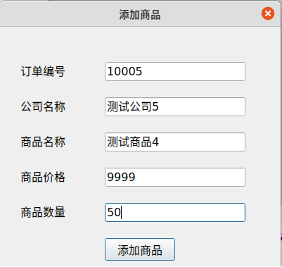
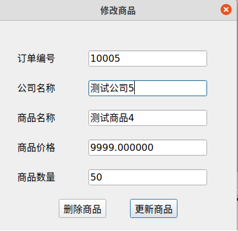

# 订单管理系统
## 介绍
该系统用于公司对于订单的管理，主要的功能包括订单添加，订单的查询，删除订单以及按条件查询订单。
## 开发环境
* GCC 9.3.0
* Ubuntu 20.04 LTS
* CMAKE 3.14 
* Qt 5.12.8
* c++ 11标准

## 主要功能
* 添加订单
* 修改订单
* 删除订单
* 查询统计订单，可以使用正则表达式来查询订单

## 演示
主界面截图

添加订单界面截图

修改界面截图

